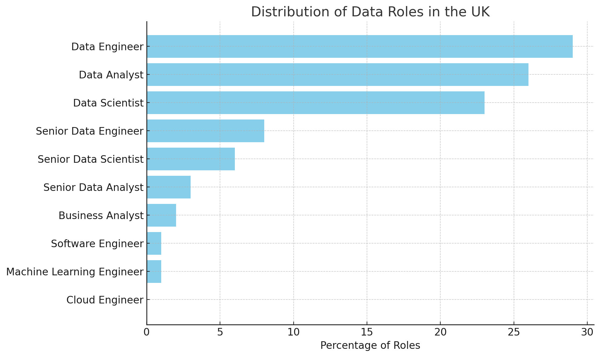

# 📊 UK Data Job Market Analysis 🚀
## 📌 Overview
📢 This project dives into the **UK data job market**, analyzing trends in:  

- **💼 The most common job in the UK** 🏆📊  
- **🚀 Which skills are most in demand** 🔥📈  
- **💰 How salaries vary** 📉💵  

📊 Using datasets from various job postings, we explore **industry trends, skill requirements, and earning potential**.  

 Hoping to become a data analyst or similar roles? This analysis provides key insights to help you navigate the industry! 📊📈

 📌 **SQL Queries** ➡️ [Project SQL](/project_sql/)  💾


## Background
Coming from a background in aviation engineering and carpentry, with experience at Princess Yachts, I’ve decided to take a bold step and shift my career towards the **dynamic field of data analysis**. 📊

After years of honing my problem-solving skills and seeing firsthand how data is transforming industries, I realized the immense potential data holds. The UK, with its booming data industry, offers exciting opportunities in this field, and I’m committed to mastering the essential skills **—from SQL and Python to Excel and Tableau—** that are in high demand. 🔧💻

This project represents my journey toward understanding the key aspects of the UK data job market, focusing on 🎯**in-demand roles, required skills, and salary expectations**.

### 💡Through my SQL queries, I sought to answer the following questions:
1. What are the most common data roles in the UK?
2. Which are the top-paying analytic roles in the UK, and which companies are offering them?
3. What are the key skills required for these roles, and how do they differ based on experience?
4. Which skills are the most desirable for data analyst roles?
5. What skills are the most rewarding in terms of salary?
6. Which skill is the most optimal to learn, considering both demand and earning potential?

I’m excited to dive deep into the data, acquire the right skills, and uncover the diverse job opportunities that lie ahead in the data industry. 🚀📈

## 🛠️Tools i used
For my deep dive into the data analytics job market, I leveraged several key tools:

🧠**SQL:** The backbone of this project, enabling me to query the database and extract critical insights.

🗄️**PostgreSQL:** A robust database management system, ideal for handling the job posting data used in this analysis.

💻**Visual Studio Code:** My platform of choice for executing SQL queries and managing code.

🌍**Git & GitHub:** Used to share my SQL scripts and analysis, version control, and collaborate with others.
## 🔍The analysis
Each query for this project aimed at investigating specific aspect of the data analytic job market in the UK. Here's how I approached each question:
### 1. What are the most common data roles in the UK?
To identify the data roles with the most job postings in the UK, it's essential to understand the demand for different roles. This analysis aims to provide a brief guide to help navigate the job market.
```sql
WITH top_paying_role_UK as 
(
    SELECT
    job_id,
    job_title,
    job_title_short,
    name as company_name,
    salary_year_avg *0.79 as average_salary_yearly_GBP,
    job_country as country
FROM
    job_postings_fact
INNER JOIN company_dim on company_dim.company_id = job_postings_fact.company_id
WHERE 
    (job_country = 'United Kingdom' or
    job_country = 'England')
),
role_counts AS (
    SELECT
        job_title_short AS Data_role,
        COUNT(job_id) AS role_count
    FROM top_paying_role_UK
    GROUP BY job_title_short
)
SELECT
    Data_role,
    role_count,
    ROUND((role_count * 100.0) / SUM(role_count) OVER(), 0) AS percentage
FROM role_counts
ORDER BY role_count DESC; 
```
#### 📊 **Most Common Data Roles in the UK** 



- **Data Engineer (29%)** 🔧🏗️

- **Data Analyst (26%)** 📊🔍

- **Data Scientist (23%)** 🤖📈

#### 🚀 **Key Insights**:

- Together, **Data Analysts** and **Data Scientists** account for **49%** of all roles, underscoring the growing importance of **insights** and **machine learning** in today’s job market.
- **Engineering roles** (Data Engineers + Senior Data Engineers) make up **37%**, reflecting a critical need for **data infrastructure expertise**.
- **Senior Analyst roles** are rare (just **3%**), suggesting limited **upward mobility** for analysts compared to engineers and scientists.
- **Machine Learning Engineers** are few (**1%**), indicating that this is a highly specialized niche within the broader **Data Scientist** role.

### 2. Which are the top-paying analytic roles in the UK, and which companies are offering them?
This section identifies the top-paying data roles and the companies offering them, aiming to provide insights into how the UK data job market is structured. By analyzing these roles, I highlight which sectors are both the **most rewarding** 💸 and **in-demand** 🔥.
```sql
SELECT
    job_title,
    name as company_name,
    salary_year_avg * 0.79 as average_salary_yearly_GBP,
    job_country as country
FROM
    job_postings_fact
INNER JOIN company_dim on company_dim.company_id = job_postings_fact.company_id
WHERE
    job_title ilike '%analyst%' 
    and
    (job_country = 'United Kingdom' or
    job_country = 'England')
    and
    salary_year_avg is not null
ORDER BY
    salary_year_avg DESC
```
#### 💸 **Highest-Paying Data Analyst Roles in the UK**

In this dataset, the highest-paying data analyst role is **"Market Data Lead Analyst"** at **Deutsche Bank**, offering an impressive **£142,200** per year. 🏦💼

Other top-paying companies include:
- **Plexus Resource Solutions** offering **£130,350** for senior-level roles. 💼✨
- **Octopus Energy** with **£93,330.60** for their senior data roles. ⚡💡

#### 🏆 **Key Insights**:
- **Finance, banking, and energy sectors** dominate the highest-paying data roles. 💰🔍
- Senior-level roles in these industries command top salaries, making them highly lucrative career paths. 🚀

This highlights that, for those seeking high-paying data analyst positions, focusing on these sectors and roles could be a smart strategy to maximize earning potential. 💼💡

### 3. What are the key skills required for these roles, and how do they differ based on experience?
In this analysis, I explored the **skills required** for data analyst jobs in the UK, focusing on how these skills vary based on experience level. 📊

```sql
WITH top_paying_role_UK as 
(
    SELECT
    job_id,
    job_title,
    name as company_name,
    salary_year_avg *0.79 as average_salary_yearly_GBP,
    job_country as country
FROM
    job_postings_fact
INNER JOIN company_dim on company_dim.company_id = job_postings_fact.company_id
WHERE
    job_title ilike '%analyst%' 
    and
    (job_country = 'United Kingdom' or
    job_country = 'England')
    and
    salary_year_avg is not null
)

select
    job_title,
    company_name,
    skills
from skills_job_dim
inner join skills_dim on skills_dim.skill_id = skills_job_dim.skill_id
inner join top_paying_role_UK on top_paying_role_UK.job_id = skills_job_dim.job_id
order BY
    average_salary_yearly_GBP DESC
```
#### 🔑 **Key Skills**:
- **SQL**: The backbone of data analysis! Found in the majority of job postings, making it an essential skill for data analysts. 📝
- **Python**: Frequently mentioned, signaling that scripting and data manipulation are crucial in modern data analysis. 🐍
- **Excel**: Still widely used, especially in **business intelligence** and **financial analysis** roles. 📊
- **Tableau / Power BI / Looker**: These **visualization tools** are vital for **data storytelling**, helping analysts communicate insights effectively. 📈

#### 📊 **Skill Differences: Senior vs Junior Roles**:

- **Junior Data Analysts**: 
  - Focus on core tools like **Excel**, **SQL**, and **Power BI/Tableau**.
  - Strong foundation in **data cleaning** and **reporting**. 🔧
  
- **Senior Data Analysts**: 
  - Expected to have proficiency in **Python**, **SQL**, and **advanced tools** like **Databricks**, **Spark**, and **Kubernetes**. 🌐
  - Familiarity with **Cloud platforms** like **AWS**, **Azure**, and **GCP** is essential for handling large-scale data. ☁️

#### 🚀 **Key Takeaways**:
- **Core tools** like **SQL** and **Excel** remain vital across all roles.
- As you move to more **senior positions**, expect to see a greater demand for **Python**, **Cloud platforms**, and **big data tools** like **Spark** and **Databricks**.


This emphasizes the **growth potential** in data analytics and highlights the need for **continuous learning** and **upskilling!** 📚💡

### 4. Which skills are the most desirable for data analyst roles?
To understand the **high-demand skills** for data analysts in the UK, we analyzed the frequency of skills mentioned in job postings. The more a skill appears, the greater its demand in the job market.
```sql
WITH top_paying_role_UK as 
(
    SELECT
    job_id,
    job_title,
    name as company_name,
    salary_year_avg * 0.79 as average_salary_yearly_GBP,
    job_country as country
FROM
    job_postings_fact
INNER JOIN company_dim on company_dim.company_id = job_postings_fact.company_id
WHERE
    job_title ilike '%analyst%' 
    and
    (job_country = 'United Kingdom' or
    job_country = 'England')
    and
    salary_year_avg is not null
),
skill_counts as
(

select
    skills,
    count(skills) as skill_count
from skills_job_dim
inner join skills_dim on skills_dim.skill_id = skills_job_dim.skill_id
inner join top_paying_role_UK on top_paying_role_UK.job_id = skills_job_dim.job_id
GROUP BY
    skills
)

select
    skills,
    skill_count,
    round(skill_count*100/sum(skill_count) over (),0) as percentage
from
skill_counts
ORDER BY
    percentage DESC
Limit 10
```


#### 🏆 **Most In-Demand Skills**:

- **SQL** (16%) - The most in-demand skill, appearing **41 times** in job postings.
- **Excel** (12%) - A close second, with **31 occurrences**. 
- **Python** (10%) - A versatile programming language with **26 mentions**

#### 🔑 **Key Insights**:
- **SQL**, **Excel**, and **Python** are foundational to data analysis and are the most consistently required skills.
- **Tableau** is in higher demand than **Power BI**, showing the preference for specific data visualization tools in job postings. 📊🔍

By focusing on these key skills—**SQL**, **Excel**, and **Python**—you can position yourself as a competitive candidate in the data analytics job market! 🚀

### 5. What skills are the most rewarding in terms of salary?
To determine which skills can offer the best financial returns, I analyzed salary data and identified the top-paying skills in data analytics. These skills are worth investing your time and effort into, especially if you're aiming for high-paying roles.
```sql
WITH top_paying_role_UK as 
(
    SELECT
    job_id,
    job_title,
    name as company_name,
    salary_year_avg *0.79 as average_salary_yearly_GBP,
    job_country as country
FROM
    job_postings_fact
INNER JOIN company_dim on company_dim.company_id = job_postings_fact.company_id
WHERE
    job_title ilike '%analyst%' 
    and
    (job_country = 'United Kingdom' or
    job_country = 'England')
    and
    salary_year_avg is not null
)

select
    skills,
    round(avg(average_salary_yearly_GBP),0) as earning_average
from skills_job_dim
inner join skills_dim on skills_dim.skill_id = skills_job_dim.skill_id
inner join top_paying_role_UK on top_paying_role_UK.job_id = skills_job_dim.job_id
GROUP BY
    skills
order BY
    earning_average DESC
```

#### 🏆 **Top Highest-Paying Skills**:

- **MySQL**: £104,083 💰 
- **Firebase**, **PostgreSQL**, **Airflow**, **Kubernetes**, and **GitHub**: £93,331 each 🔝
- **Cognos**, **SAP**, and **NoSQL**: £87,828 each 💼

#### 💡 **Key Insights**:
- **Database Skills**: MySQL, PostgreSQL, and NoSQL are key players when it comes to high-paying roles, showing the value of solid data management expertise. 🗄️📊
- **Cloud & Big Data Tools**: Tools like **AWS**, **Databricks**, and **Kubernetes** offer excellent pay, reflecting the industry's reliance on cloud and big data technologies. ☁️🔧
- **Visualization**: **Tableau** (£65,941) outshines **Power BI** (£59,949) in terms of salary, making it a more lucrative choice for data visualization. 📊💡

#### 📊 **Conclusion**:
Focusing on database management skills like **MySQL** and **PostgreSQL**, cloud technologies like **AWS** and **Kubernetes**, and business intelligence tools like **Cognos** can significantly boost your salary potential.

 Additionally, prioritizing **Tableau** over **Power BI** for visualization and learning **Airflow** for big data workflows can increase your earnings in the data analytics industry. 💼💵

### 6. Which skill is the most optimal to learn, considering both demand and earning potential?
Choosing the right skills to focus on is crucial in building a career in data analytics. By balancing **demand** with **earning potential**, we can identify the most valuable skills to invest time and effort into.
```sql
WITH top_paying_role_UK as 
(
    SELECT
    job_id,
    job_title,
    name as company_name,
    salary_year_avg * 0.79 as average_salary_yearly_GBP,
    job_country as country
FROM
    job_postings_fact
INNER JOIN company_dim on company_dim.company_id = job_postings_fact.company_id
WHERE
    job_title ilike '%Data%analyst%' 
    and
    (job_country = 'United Kingdom' or
    job_country = 'England')
    and
    salary_year_avg is not null
),
skill_counts as
(
select
    skills_job_dim.skill_id,
    skills,
    count(skills) as skill_count
from skills_job_dim
inner join skills_dim on skills_dim.skill_id = skills_job_dim.skill_id
GROUP BY
    skills_job_dim.skill_id,
    skills
)

select
    skills,
    skill_count,
    round(avg(average_salary_yearly_GBP),0) as average_salary
from skill_counts
inner join skills_job_dim on skills_job_dim.skill_id = skill_counts.skill_id
inner join top_paying_role_UK on top_paying_role_UK.job_id = skills_job_dim.job_id
GROUP BY
    skills, skill_count
order BY
    skill_count DESC, average_salary DESC
```
#### 🔥 **Top Skills in Demand**:
- **SQL** (16% demand) 
- **Excel** (12% demand) 
- **Python** (10% demand)

#### 💸 **Top-Paying Skills**:
- **MySQL** (£104,083) 
- **Airflow**, **Firebase**, **Kubernetes**, **GitHub**, and **PostgreSQL** (£93,331 each) 
- **NoSQL**, **Cognos**, **SAP** (£87,828 each) 

#### 🏅 **Optimal Skills to Learn**:
When considering both **demand** and **earning potential**, these are the most **optimal skills** to learn:

- **SQL**: With its high demand (16%) and solid earning potential, SQL is the cornerstone of a successful data career. 🗄️💸
- **Python**: Given its growing demand (10%) and high pay potential, Python is a top skill to learn for advanced data manipulation and machine learning. 🐍💻
- **PostgreSQL** and **MySQL**: As critical database management skills, both are in demand and highly paid (£93,331+). 🔐
- **Airflow** and **Kubernetes**: These cloud and workflow management tools are in high demand and command impressive salaries (£93,331). ☁️🔧
- **Tableau**: If you're focusing on data visualization, **Tableau** stands out for both demand and higher salary (£65,941). 📊

#### 💡 **Conclusion**:
To make the most informed choice, focus on **SQL**, **Python**, and **PostgreSQL** for solid earnings and demand. If you’re interested in cloud computing and big data, **Airflow** and **Kubernetes** are optimal for future growth, while **Tableau** offers excellent potential for those interested in data visualization. By mastering these skills, you'll be in a prime position to excel in the data analytics industry. 🚀💼

## 🎓What I learned
Throughout this analysis, I gained valuable insights into the most in-demand skills for data-related roles. By working with real-world data, I reinforced my ability to clean, organize, and visualize information effectively. Some key takeaways include:  

- 🔍 **SQL, Excel, and Python Dominance** – SQL remains the most sought-after skill, followed by Excel and Python, emphasizing their importance in data analysis and business intelligence.  
- 📊 **Visualization Tools Matter** – Tableau and Power BI are among the top skills, highlighting the industry's reliance on effective data storytelling.  
- ☁️ **Cloud & Big Data Tools** – Technologies like AWS, Azure, and BigQuery are becoming essential for handling large-scale data operations.  
- 🛠️ **Broad Skillset in Demand** – Apart from core technical skills, knowledge of programming languages (e.g., R, JavaScript, and Go) and data management tools (e.g., Hadoop, Spark, and Snowflake) can provide a competitive edge.  

Through this process, I also improved my ability to interpret trends, work with **Matplotlib** for visualization 🎨, and refine my **data-driven decision-making skills** 📈.  

## 📝Conclusion
### Insights
This analysis provided valuable insights into the most in-demand skills for data-related roles. The findings highlight the dominance of **SQL, Excel, and Python**, reinforcing their importance in data analytics and business intelligence. Additionally, the growing demand for **data visualization tools** like Tableau and Power BI emphasizes the need for effective data storytelling.  

#### **Key Takeaways:**  
- ✅ **SQL is essential** – With SQL leading in skill demand, mastering it is crucial for querying and managing data efficiently.  
- 📈 **Python vs. Excel** – While Excel remains widely used, Python's increasing demand suggests a shift toward automation and advanced analytics.  
- ☁️ **Cloud & Big Data Growth** – The presence of AWS, Azure, and BigQuery in the dataset highlights the industry's shift towards cloud-based solutions.  
- 🔥 **Diversifying Skills** – Knowledge of complementary tools like Spark, Hadoop, and Snowflake can enhance career opportunities in data engineering and analytics.  

### Closing thoughts
Finishing my first project has been both challenging and rewarding. As I reflect on the journey, I feel a great sense of accomplishment. The process has been a true learning experience—one that has stretched my abilities and provided me with insights into both my strengths and areas for growth. 🚀

Throughout this project, I’ve gained invaluable skills in data analysis, problem-solving, and time management. 🧠 I’ve learned how to apply my knowledge in a practical setting, adapt to new tools and technologies, and think critically under pressure. 💻 There were moments of frustration, but they were always followed by breakthroughs that reinforced my resilience and determination. 💪

As I move forward, I understand the importance of continually equipping myself with the right tools and mindset. 🔧 This experience has shown me that being adaptable and willing to learn are key to success in this field. 📚 I will continue to build on what I’ve learned, sharpening my skills in Excel, SQL, Python, and beyond. 🐍

Ultimately, this project has laid a strong foundation for my growth in data analysis, and I’m excited about what the future holds. 🌱 Every step of this journey has brought me closer to my goals, and I’m ready to take on the next challenge with even more confidence. 🎯